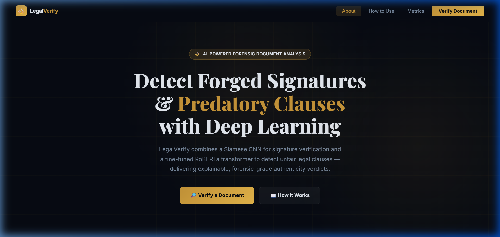
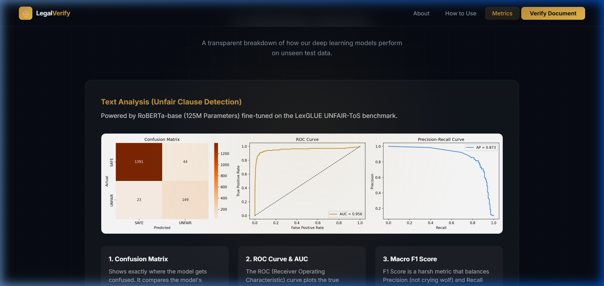
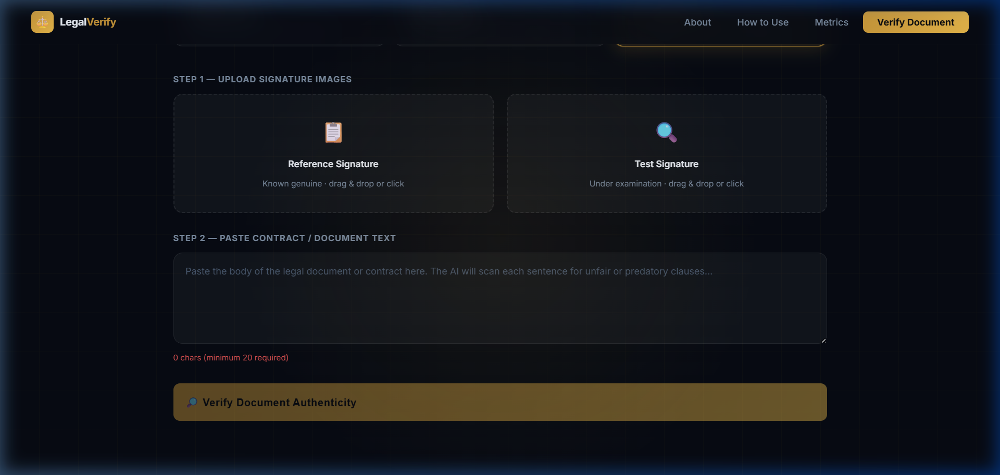

<div align="center">

# ⚖️ Legal Document Authenticity Verifier

**A multi-modal AI system that verifies legal contract authenticity** by fusing computer-vision signature forensics with NLP-based clause risk analysis into a single, explainable decision.


</div>

---

## 📋 Table of Contents

- [System Overview](#️-system-overview)
- [UI Previews](#-user-interface-previews)
- [Technical Architecture](#️-technical-architecture)
- [Core Model Benchmarks](#-core-model-benchmarks)
- [Repository Structure](#-repository-structure)
- [Datasets](#-datasets)
- [Setup](#-step-by-step-setup)
- [Analysis & Decision Logic](#-analysis--decision-logic)
- [Explainable AI Engine](#-explainable-ai-xai-engine)
- [License & Disclaimer](#-license--disclaimer)

---

## ⚙️ System Overview

Verifying whether a legal document is genuine usually comes down to two separate questions — *is the signature real?* and *are the terms fair?* This system answers both in parallel and fuses them into one explainable risk score.

1. **Signature Verification (Physical Modality)**
   - A **Siamese CNN with a VGG16 backbone**, trained using contrastive loss on the CEDAR dataset
   - Compares a scanned test signature against a known reference to identify skilled forgeries
   - Uses **Grad-CAM** spatial heatmaps to highlight suspicious pen strokes

2. **Contract Analysis (Semantic Modality)**
   - A **RoBERTa-base classifier**, fully fine-tuned on the LexGLUE UNFAIR-ToS benchmark
   - Flags predatory or non-compliant clauses (unilateral termination, forced arbitration, hidden liability exclusions)
   - Uses **SHAP** token attribution to highlight the exact words driving the warning

A **Supervisor Agent** fuses both modality scores into a unified rating — **AUTHENTIC** or **SUSPICIOUS**.

---

## 📱 User Interface Previews

### 1. Unified UI Dashboard (About & Overview)
The homepage provides a comprehensive overview of the AI capabilities, statistics, and technologies driving the document verification system.


### 2. Scientific Validation & Model Metrics
Visualizes validation metrics of the deep learning models on unseen test datasets — confusion matrices, ROC curves, and score separation charts.


### 3. Verification Interface
The core interface where users select verification workflows, upload genuine/query signatures, and input contract clauses for evaluation.


---

## 🛠️ Technical Architecture

```
                       [Scanned Signature & Contract Text]
                                        |
                 ┌──────────────────────┴──────────────────────┐
                 ▼                                             ▼
        [Signature Images]                              [Contract Text]
                 |                                             |
     [Preprocessing Agent]                           [Preprocessing Agent]
                 |                                             |
       [Signature CNN Agent]                           [Text RoBERTa Agent]
      (Siamese VGG16 Backbone)                      (Fine-Tuned Classifier)
                 |                                             |
          similarity_score                             unfair_clause_score
                 |                                             |
                 └──────────────────────┬──────────────────────┘
                                        ▼
                               [Supervisor Agent]
                         Combined Risk Fusion Formula:
                 (0.6 * sig_risk) + (0.4 * unfair_clause_score)
                                        |
                 ┌──────────────────────┴──────────────────────┐
                 ▼                                             ▼
            [Grad-CAM]                                      [SHAP]
    (Signature Stroke Heatmap)                     (Text Attribution Weights)
                 └──────────────────────┬──────────────────────┘
                                        ▼
                            [Unified UI Dashboard]
```

---

## 📊 Core Model Benchmarks

| Pipeline | Model Architecture | Metric | Score |
| :--- | :--- | :--- | :--- |
| **Signature Verification** | Siamese VGG16 (Contrastive Loss) | Accuracy | **80.21%** |
| **Signature Verification** | Siamese VGG16 (Contrastive Loss) | AUC | **0.9209** |
| **Contract Analysis** | RoBERTa-base (Fine-Tuned Classifier) | Accuracy | **95.83%** |
| **Contract Analysis** | RoBERTa-base (Fine-Tuned Classifier) | Macro F1 | **89.65%** |
| **Contract Analysis** | RoBERTa-base (Fine-Tuned Classifier) | AUC | **0.956** |

---

## 📂 Repository Structure

```text
legal-doc-verifier/
├── docs/                     # Screenshot assets and documentation
├── backend/                  # FastAPI Application
│   ├── api.py                # REST API endpoints & server setup
│   ├── agents/                # Multi-agent inference pipeline
│   ├── models/                # Model architectures and saved weights
│   │   ├── siamese_cnn.py     # Siamese CNN for signature verification
│   │   ├── roberta_nlp.py     # RoBERTa-base classifier for text
│   │   └── saved/              # Production model weights (.pt files)
│   ├── xai/                   # Explainable AI scripts (Grad-CAM, SHAP)
│   ├── data/                  # Sample test datasets & evaluation data
│   ├── results/               # Model evaluation metrics & validation charts
│   └── requirements.txt       # Backend Python dependencies
├── frontend/                  # React UI Client
│   ├── src/                    # React components, styles, and hooks
│   ├── index.html              # Entrypoint HTML
│   └── package.json            # Frontend dependencies & scripts
├── colab_notebooks/           # Training pipelines
│   ├── notebook1_siamese_training.py       # Siamese CNN training notebook
│   └── notebook2_unfair_clause_training.py # RoBERTa fine-tuning notebook
└── README.md                  # Project README documentation
```

---

## 💾 Datasets

Model weights are trained on peer-reviewed research benchmarks:

- **CEDAR Signatures** — benchmark dataset for offline signature verification containing genuine and forged signatures
- **LexGLUE UNFAIR-ToS** — standard benchmark subset (from `coastalcph/lex_glue`) containing clauses annotated by legal experts for fairness across terms-of-service documents

---

## 🚀 Step-by-Step Setup

### 1. Install Dependencies

**Backend:**
```bash
cd backend
pip install -r requirements.txt
```

**Frontend:**
```bash
cd frontend
npm install
```

### 2. Download and Place Model Weights

To run local inference, place the trained weights in the corresponding directory:
- Download `siamese_best.pt` → `backend/models/saved/`
- Download `roberta_unfair_clause.pt` → `backend/models/saved/`

> You can also train these models from scratch using the scripts in `colab_notebooks/`.

### 3. Run the Application

Open two terminal sessions:

**Backend API (FastAPI):**
```bash
cd backend
python -m uvicorn api:app --reload --port 8000
```

**Frontend Client (React + Vite):**
```bash
cd frontend
npm run dev
```

Navigate to `http://localhost:5173` to access the interactive web interface.

---

## 🧠 Analysis & Decision Logic

The frontend supports three verification workflows:

1. **Signature Only** — compares a reference signature image with a query signature image
2. **Contract Scan** — analyzes legal text to detect and highlight predatory clauses
3. **Full Verification** — performs both tasks and fuses the results

### Risk Score Fusion Formula

```text
sig_risk      = 1.0 - signature_similarity_score
unfair_score  = unfair_clause_probability_score

combined_risk = (0.6 * sig_risk) + (0.4 * unfair_score)
```

- **Decision Boundary**: flagged **SUSPICIOUS** if `combined_risk >= 0.40`, otherwise **AUTHENTIC**
- **Rationale**: physical signature integrity is weighted higher (60%) since forgery is an absolute indicator of fraud, while unfair clauses (40%) represent high semantic risk but don't necessarily mean the document was forged

---

## 🔬 Explainable AI (XAI) Engine

Transparency is a core requirement of AI-powered document verification:

- **Signature Heatmaps** — Grad-CAM hooks into the final convolutional layers of the Siamese towers to extract gradients relative to embedding distance, generating a colorized overlay where red areas mark the pen hesitation or deviation that influenced the forgery rating
- **Text Attribution** — SHAP runs local perturbations by masking input tokens, showing which terms and contract phrases contributed most toward the "Unfair" classification

---

## 📜 License & Disclaimer

This project is intended for research, education, and screening purposes. It is **not** a substitute for professional forensic document analysis or formal legal counsel.

---

<div align="center">

*Built by [Ghayur](https://github.com/ghayurcodes)*

</div>
